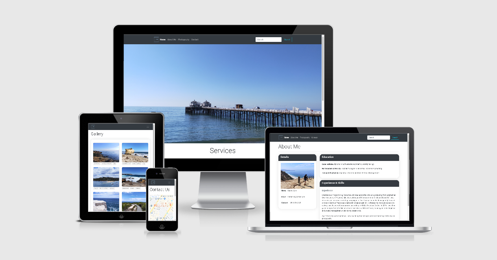

# Kubex | Portfolio #

### User Centric Frontend Development Milestone Project - Code Institute ###
By: Kareen Lim

## Demo
A live demo of the finished project can be found [here](https://kareenlhs.github.io/Project-1/).

## Aim ##

This is a website created for myself to showcase my photography works and projects which will be built later in the course. It also includes information on the services that I aim to provide as an all-in-one media solutions provider.

## UX/UI ##

This is a four page website, designed with the following in mind:

**Target audience**
* Potential employers
* Companies/Employers looking for freelancers
* Freelancers who are looking for collaborations on projects

**Users' needs**
* Website should be user-friendly
* Information should be upfront and concise

**Design**
* Minimalist
* Organized content 
* Pleasing colors

**User Stories**
1. To highlight the services that I aim to provide as an all-in-one media solutions provider.
2. To build a minimalistic website that is easy for users to navigate and to be able to draw users' attention to the services' information.
3. To build a website with a color theme that is inline with my photography works which mainly consist of sea and costal photos. 
4. To showcase my current skills utilizing HTML5, CSS3, Bootstrap and other tools

## Features ##
* The navigation bar follows Bootstrap's breakpoints and is responsive for small, medium and large screens. The links in the navigation bar changes to a light grey color when hover over, to indicate that it is a link that user can click on which will bring them to another page of the website.
* **Home**  
The page features a hero image right below the navigation bar, followed by a write up on the services provided and a screenshot of a client's website.
A back-to-top button is provided at the bottom right to allow users to quickly navigate to the top of the page, without scrolling.
* **About Me**  
An introduction on my education background, work experience and skill set.
* **Photography**  
A gallery of some of the photos wich I have taken, with the location details.
* **Contact**  
A contact form to enable users to send me a message

Future features
* Add tags to the gallery items which can be used to search and filter the images.
* Functioning site search engine
* Add interactive website features such as user-generated reviews

## Technologies Used ##
Here is the list of programming languages, technologies and tools used for this website.

* HTML5
* CSS3
* Markdown
    * Used for writing this README.md file
* [Bootstrap Version 4](https://getbootstrap.com/)
    * Used for its page layout and responsiveness
* [Visual Studio Code](https://code.visualstudio.com/)
    * Used as the IDE to write the codes for this website   
* [Google Fonts](https://fonts.google.com/)
    * Used 'Roboto'
* [Free Logo Design](http://freelogodesign.org) 
    * Used for creating brand logo
* [Github](https://github.com)
* [Am I Responsive?](http://ami.responsivedesign.is/?url=#)
    * Used to see across multiple devices with different screen sizes the responsiveness of the website

## Testing ##
The website was tested on different web browsers and on different devices. 

Devices and browsers:
* Oppo R17
    * Google Chrome
* Windows 10
    * Google Chrome
    * Microsoft Edge
    * Firefox
* iPad
    * Safari
    * Google Chrome

The Google Chrome Devtools was used to view the website on a number of stimulated mobile and tablet to ensure compatibility and responsiveness. They include Galaxy S5, Pixel 2, Pixel 2 XL, iPhone 5 / SE, iPhone 6/7/8, iPhone 6/7/8 plus, iPhone X, iPad Pro and Surface Duo.

I also tested the contact form manually by trying to submit an empty form, so as to verify that an error message for the required fields appears. 

## Deployment ##
[Github]((https://github.com)) hosts the repository for all commits.

Please click [here](https://kareenlhs.github.io/Project-1/) to find the deployed  website, using Github pages. The pages will automatically be updated upon new commits to the master branch.

## Credits ##
The codes used in the site were made reference from [Bootstrap](https://getbootstrap.com) and [W3 School](https://www.w3schools.com).
The icons used in this site were obtained from [Google](https://google.com).

